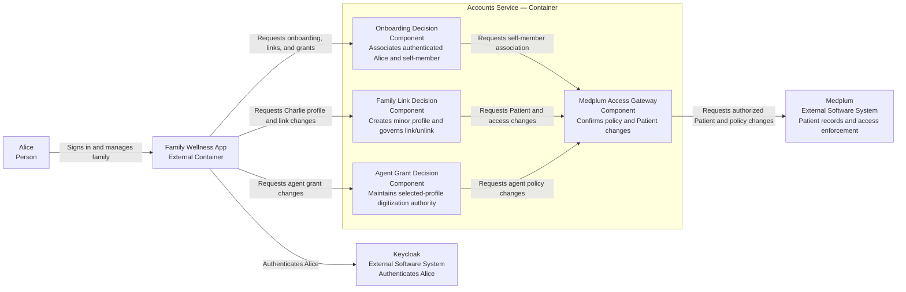

# Accounts — Software Design Description

**Status:** Proposed design for PR1 review; not verified.

## Purpose and scope

This SDD allocates the [Accounts user needs and AC](../requirements/accounts.md) to account onboarding, minor profiles, family links, and separate agent grants. Keycloak supplies Alice's authentication as an external fact. Medplum stores the Patient/profile and enforces the resulting access policy; Accounts owns the meaning and lifecycle of family and agent authority.

The OpenAPI contract owns request and response shapes. This SDD does not repeat them. Identifier-collision recovery after referral to a Medplum admin remains open. The minor relationship is self-reported for the local MVP path; no independent guardian verification is claimed.

## Design-input allocation

| Input | Baseline AC | Responsibility |
|---|---|---|
| `DI-ACC-001` | `AC-ACC-001`–`002` | Onboarding and self-member association |
| `DI-ACC-002` | `AC-ACC-003` | Minor profile creation |
| `DI-ACC-003` | `AC-ACC-004`, `006` | Family-link completion after access provisioning |
| `DI-ACC-004` | `AC-ACC-005` | Identifier-collision refusal |
| `DI-ACC-005` | `AC-ACC-007`–`008` | Separate selected-profile agent grant |
| `DI-ACC-006` | `AC-ACC-009`–`010` | Profile-specific agent revocation |
| `DI-ACC-007` | `AC-ACC-011`–`012` | Family unlink after access removal |

These are baseline design inputs, not risk-control allocations.

## C3 — Proposed Accounts service responsibilities

The service and component names describe responsibilities, not a required class or process layout. The diagram is a proposed component view, not evidence that these components already exist.

## Decision and integration rules

- Accounts distinguishes Alice's authenticated account from a member profile and from an agent grant. Charlie is a minor member, not a login principal.
- A family link is not complete on an access-provisioning request alone; Medplum must confirm the resulting limited access.
- Agent scope is selected-profile digitization, not a copy of Alice's broader policy. Removing Charlie from the agent grant does not remove Alice's own Charlie access or the agent's Alice access.
- Ending the Charlie link requires both Alice and derivative agent Charlie access to be removed before completion is reported. A failed removal leaves the link active.
- A Medplum `403` at measurement save time is authoritative for current access. A past `Agent Access Granted` event cannot substitute for that check.

## Open design points

- The exact wellness-only classification and Medplum policy must be demonstrated before claiming Charlie's clinical chart is inaccessible.
- The authorized Medplum actor and provisioning path for applying Alice's family and agent grant changes are open. This SDD does not assume Alice or the digitization agent can directly edit access policy, or introduce a broad service account.
- The privacy-safe collision message and Medplum admin recovery path are not yet agreed.
- Previously issued-token behavior after membership change requires an HTTP test against the intended Medplum server version.

No control effectiveness, residual-risk acceptability, or completed verification is claimed.
