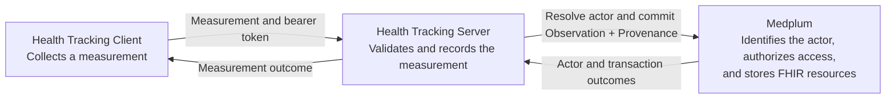
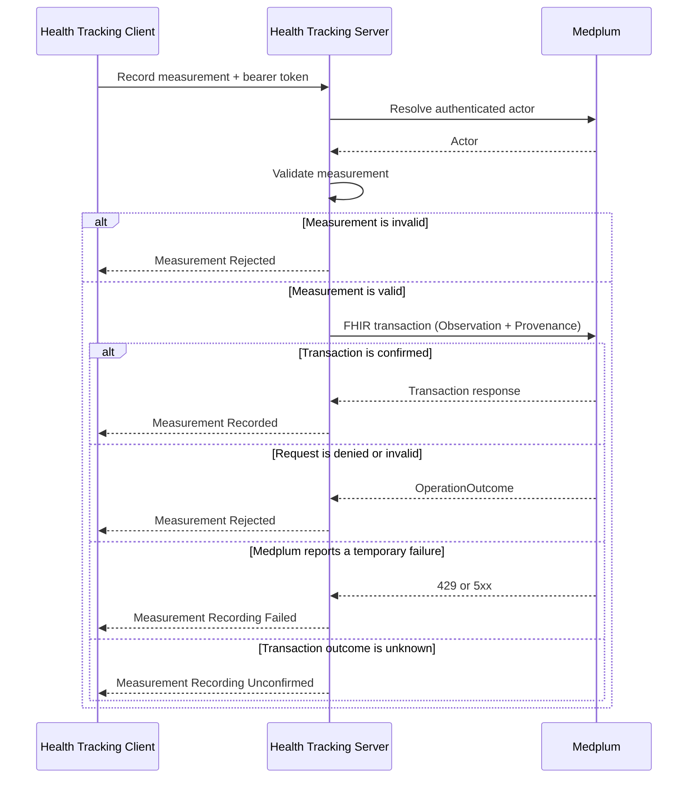

# Health Tracking — Software Design Description

**Status:** Draft.

## Purpose

This document describes how Health Tracking records a member's height or
weight in Medplum and reports the result to the client.

## Scope

The design covers the synchronous path from an authenticated measurement
request to a FHIR `Observation` and its `Provenance`.

The Flutter client, offline synchronization, measurement history, BMI, steps,
sleep, climate capture, Medplum `AccessPolicy` configuration, and deployment
are outside this design.

## Design input

| ID     | Source      | Required result                                                                                                                   | Baseline acceptance criteria          |
| ------ | ----------- | --------------------------------------------------------------------------------------------------------------------------------- | ------------------------------------- |
| `DI-1` | `UN-HT-001` | Record one height or weight measurement for the intended member while preserving its identity, value, unit, and observation time. | `AC-HT-001`, `AC-HT-002`, `AC-HT-003` |

`DI-1` is a baseline requirement, not a risk control.

## Design overview

The Health Tracking server performs one Record Measurement operation:

1. Resolve the authenticated actor through Medplum using the caller's bearer
   token.
2. Validate the measurement identifier, intended member, type, value, unit,
   and observation time.
3. Submit the `Observation` and `Provenance` together in one Medplum FHIR
   transaction using the same bearer token.
4. Report `Measurement Recorded` only when Medplum confirms the transaction.
5. Report a rejected, failed, or unconfirmed outcome when recording does not
   complete successfully.

## Runtime flow

## Medplum FHIR design

| Information            | FHIR representation                                               |
| ---------------------- | ----------------------------------------------------------------- |
| Measurement identifier | `Observation.id`                                                  |
| Intended member        | `Observation.subject.reference` as a `Patient` reference          |
| Observation time       | `Observation.effectiveDateTime` and `Provenance.occurredDateTime` |
| Height                 | Body Height profile and LOINC `8302-2`                            |
| Weight                 | Body Weight profile and LOINC `29463-7`                           |
| Value and unit         | `Observation.valueQuantity` with UCUM coding                      |
| Authenticated actor    | `Provenance.agent.who`                                            |

The transaction updates `Observation/{id}` and conditionally creates its
`Provenance`. Recording both resources in one transaction prevents a confirmed
measurement without its actor record.

There is no service account in this path. The same user token is used to
resolve the actor and submit the transaction. Medplum applies its configured
access policy.

## Outcomes

| Condition                         | Outcome                                               | HTTP status |
| --------------------------------- | ----------------------------------------------------- | ----------- |
| Bearer token is absent or invalid | FHIR `OperationOutcome`                               | `401`       |
| Measurement is invalid            | `Measurement Rejected / Invalid Measurement`          | `400`       |
| Medplum denies access             | `Measurement Rejected / Not Permitted`                | `403`       |
| Medplum rejects the FHIR data     | `Measurement Rejected / Invalid Measurement`          | `400`       |
| Medplum reports `429` or `5xx`    | `Measurement Recording Failed / Record Unavailable`   | `503`       |
| Transaction outcome is unknown    | `Measurement Recording Unconfirmed / Outcome Unknown` | `503`       |
| Transaction is confirmed          | `Measurement Recorded`                                | `201`       |

## Verification and traceability

| Source                               | Design input | Design output                         | Verification status                                                    |
| ------------------------------------ | ------------ | ------------------------------------- | ---------------------------------------------------------------------- |
| `UN-HT-001`; `AC-HT-001`–`AC-HT-003` | `DI-1`       | Record Measurement flow and FHIR data | HTTP success-path evidence exists; independent review is not recorded. |
| EventStorming failure outcomes       | —            | Record Measurement outcomes           | Development tests pass; formal acceptance evidence is not recorded.    |

## Risk status

Safety risks `SAF-HT-001`–`SAF-HT-003` and STRIDE threats
`SEC-HT-001`–`SEC-HT-006` are identified but not yet evaluated. This design
does not allocate risk controls or claim residual-risk acceptability.

## Open design questions

- Should the intended member be supplied in the request or selected from the
  authenticated member context?
- What read path will demonstrate that the intended user can retrieve the
  recorded measurement?
- Which Medplum access policy will authorize the operation?
- What failure-path acceptance evidence and independent review are required
  before the design is baselined?
