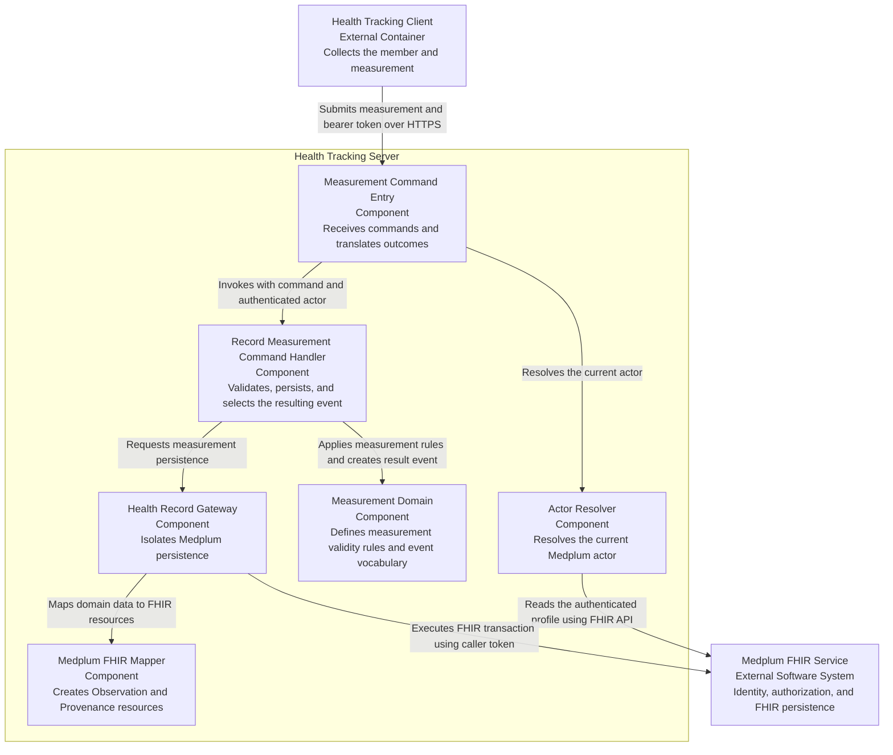
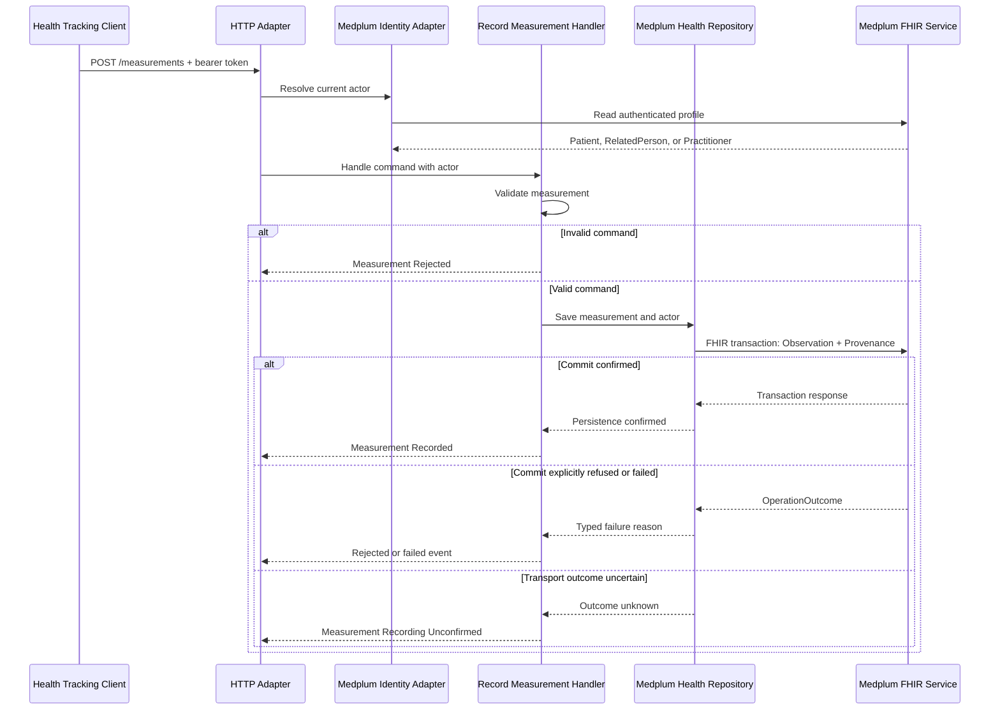

# Health Tracking — Software Design Description

**Status:** Draft.

## Purpose and scope

**Audience:** Developers and design reviewers.

**Decision supported:** Understand and review the responsibility boundaries
for recording a member's height or weight through Medplum.

**Software system in scope:** The server-side Health Tracking system.

The design covers the synchronous write path from an incoming request to a
FHIR `Observation` and its `Provenance`. It includes command validation,
current-actor resolution, FHIR mapping, persistence using the caller's bearer
token, and selection of the resulting domain event.

The Flutter client, offline synchronization, measurement-history reads, BMI,
daily steps, sleep, climate capture, Medplum `AccessPolicy` configuration, and
deployment topology are outside this SDD.

## Domain boundary

Health Tracking is the single bounded context in scope. It owns measurement
commands, rules, events, and caller-facing outcomes. Identity and access is an
external capability. The Medplum FHIR repository is a platform seam, not a
second bounded context.

## Design input

| ID     | Traces to   | Meaning                                                                                                                        | Baseline acceptance criteria          |
| ------ | ----------- | ------------------------------------------------------------------------------------------------------------------------------ | ------------------------------------- |
| `DI-1` | `UN-HT-001` | Record one height or weight measurement for one intended member and preserve its identifying clinical data in the FHIR record. | `AC-HT-001`, `AC-HT-002`, `AC-HT-003` |

`DI-1` is derived from the baseline user need. It is not a risk-control
requirement.

## Design outputs

| Design element              | Responsibility                                                          |
| --------------------------- | ----------------------------------------------------------------------- |
| Measurement command entry   | Receive a measurement command and translate its outcome                 |
| Actor resolver              | Resolve the authenticated Medplum actor from the caller's bearer token  |
| Record Measurement handler  | Validate the command, request persistence, and select the result event  |
| Measurement model           | Define valid height and weight measurements and their domain vocabulary |
| Health record gateway       | Isolate Health Tracking from Medplum persistence details                |
| Medplum FHIR mapper         | Map the measurement and actor to `Observation` and `Provenance`         |
| Medplum persistence adapter | Commit the FHIR resources atomically using the caller's token           |

## C3 — Health Tracking server components

This component view zooms into the Health Tracking server container. The
client and Medplum are outside that container.

### Component responsibilities

- The HTTP adapter owns transport concerns and composition. It does not make
  domain decisions.
- The command handler receives an authenticated actor and owns the complete
  record-measurement use case.
- The domain component contains no identity, authorization, Medplum, or FHIR
  concerns.
- The Medplum persistence adapter uses the same caller token for profile
  resolution and persistence. Medplum remains the authorization decision point.
- The FHIR mapper isolates healthcare representation from the domain model.

## Dynamic view — Record Measurement

`Measurement Recorded` occurs only after the FHIR transaction is confirmed.

## Domain-to-FHIR mapping

| Domain concept         | FHIR representation                                               |
| ---------------------- | ----------------------------------------------------------------- |
| Measurement identifier | `Observation.id`                                                  |
| Intended member        | `Observation.subject.reference` as a `Patient` reference          |
| Observation time       | `Observation.effectiveDateTime` and `Provenance.occurredDateTime` |
| Height measurement     | Body Height profile and LOINC `8302-2`                            |
| Weight measurement     | Body Weight profile and LOINC `29463-7`                           |
| Value and unit         | `Observation.valueQuantity`, with UCUM coding                     |
| Authenticated actor    | `Provenance.agent.who`                                            |

The repository writes the `Observation` and `Provenance` in one FHIR
transaction. The `Observation` uses `PUT Observation/{id}`. The `Provenance`
uses a conditional create keyed by the target observation.

## Authorization boundary

There is no service account in this path. The HTTP adapter extracts the
caller's bearer token, creates a user-scoped `MedplumClient`, and resolves the
current actor from the same client. The repository sends the FHIR transaction
with that client. Medplum evaluates its configured access policy. A Medplum
`403` outcome becomes a `Measurement Rejected` outcome with the reason
`Not Permitted`.

This describes existing behavior. It is not evidence that any identified
safety or STRIDE risk is controlled.

## Error behavior

| Condition                            | Command outcome / HTTP response                                   |
| ------------------------------------ | ----------------------------------------------------------------- |
| Bearer token absent or malformed     | HTTP `401` with a FHIR `OperationOutcome`; command not invoked    |
| Current actor unavailable            | HTTP `401` with a FHIR `OperationOutcome`; command not invoked    |
| Measurement command invalid          | `Measurement Rejected / Invalid Measurement`; HTTP `400`          |
| Medplum denies persistence           | `Measurement Rejected / Not Permitted`; HTTP `403`                |
| Medplum rejects FHIR validation      | `Measurement Rejected / Invalid Measurement`; HTTP `400`          |
| Medplum reports `429` or `5xx`       | `Measurement Recording Failed / Record Unavailable`; HTTP `503`   |
| Transport outcome is unknown         | `Measurement Recording Unconfirmed / Outcome Unknown`; HTTP `503` |
| Persistence succeeds                 | `Measurement Recorded`; HTTP `201`                                |
| Other FHIR `OperationOutcome` status | Passed through by the HTTP adapter                                |

## Verification and traceability

| Source                               | Design input | Design output                          | Verification status                                                               |
| ------------------------------------ | ------------ | -------------------------------------- | --------------------------------------------------------------------------------- |
| `UN-HT-001`; `AC-HT-001`–`AC-HT-003` | `DI-1`       | Record Measurement design elements     | HTTP success-path acceptance evidence exists; independent review is not recorded. |
| EventStorming failure outcomes       | —            | Typed command and persistence outcomes | Development tests pass; formal acceptance evidence is not recorded.               |

The HTTP acceptance test exercises the public measurement command and records
Allure evidence. Development tests are supporting evidence only. Independent
review is still required before the acceptance test can be claimed as faithful
formal verification.

## Risk-analysis boundary

Safety risks `SAF-HT-001`–`SAF-HT-003` and STRIDE threats
`SEC-HT-001`–`SEC-HT-006` remain identified but unevaluated. The approved
risk matrices and acceptability criteria are missing. Consequently, this SDD
allocates no risk-control requirements and makes no control-effectiveness or
residual-risk claim.

## Assumptions and open questions

- A deployment configuration must start and manage the Health Tracking server.
- The client and API contract for selecting the intended family member remain
  outside this document.
- The current command contract includes the intended member identifier, while
  the EventStorming model says the active member comes from context. This
  mismatch must be resolved before the design is baselined.
- The Medplum project must define the applicable access policy; this example
  does not create one.
- A read path is required to demonstrate that a persisted measurement is
  available to the intended user.
- Failure-path HTTP acceptance evidence and an independent faithfulness review
  are still required.
