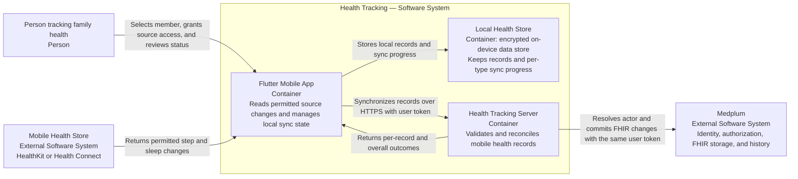
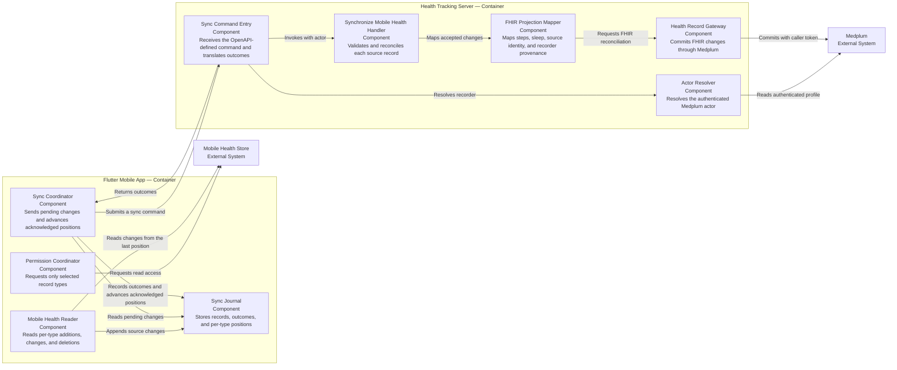
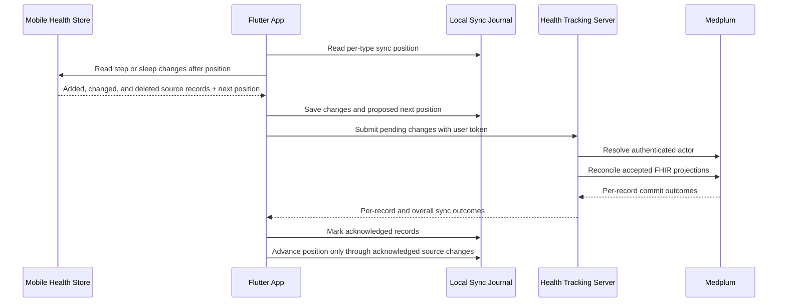

# Mobile Health Synchronization — Software Design Description

**Status:** Draft.

## Purpose and scope

**Audience:** Product, mobile, server, and design reviewers.

**Decision supported:** Agree where mobile health synchronization state and responsibilities belong before defining
the API contract or implementation.

**Software system in scope:** Health Tracking, comprising the Flutter client and Health Tracking server.

The first increment synchronizes step-count records and sleep sessions from Apple HealthKit or Android Health Connect
to the intended member's record in Medplum. Other mobile health types are outside this design.

The API request and response payloads belong to the OpenAPI entities and are not repeated in this SDD.

## Design inputs

| ID      | Required result                                        | Baseline acceptance criterion |
| ------- | ------------------------------------------------------ | ----------------------------- |
| `DI-4`  | Synchronize a permitted step-count record.             | `AC-HT-004`                   |
| `DI-5`  | Synchronize a permitted sleep session.                 | `AC-HT-005`                   |
| `DI-6`  | Preserve the step count and observed period.           | `AC-HT-006`                   |
| `DI-7`  | Preserve the sleep period and total duration.          | `AC-HT-007`                   |
| `DI-8`  | Preserve available sleep-stage type and period.        | `AC-HT-008`                   |
| `DI-9`  | Reconcile an unchanged record without duplication.     | `AC-HT-009`                   |
| `DI-10` | Reconcile source additions, changes, and deletions.    | `AC-HT-010`                   |
| `DI-11` | Continue an interrupted or incomplete synchronization. | `AC-HT-011`                   |
| `DI-12` | Report synchronization completion and exceptions.      | `AC-HT-012`                   |
| `DI-13` | Remain within the person's mobile health permissions.  | `AC-HT-013`                   |

These are baseline design inputs. They are not risk controls.

## C2 — Containers

The OS mobile health store is the source for imported records. The local store makes synchronization resumable. Medplum
is authoritative for the shared FHIR projection and applies access policy on every write.

## Responsibility boundaries

| Element                | Responsibility                                                                                                                          |
| ---------------------- | --------------------------------------------------------------------------------------------------------------------------------------- |
| Flutter mobile app     | Request platform permissions, select the intended member, read source changes, retain local progress, retry, and present status.        |
| Mobile health adapter  | Translate HealthKit anchors or Health Connect change tokens into source-neutral changes without merging records from different sources. |
| Local health store     | Retain source records and a separate synchronization position for each platform record type until the server acknowledges them.         |
| Health Tracking server | Authenticate the recorder, validate the command, reconcile each source record, and return explicit outcomes.                            |
| Medplum adapter        | Project accepted records to FHIR and submit them with the caller's token.                                                               |
| Medplum                | Authorize the actor, validate FHIR resources, preserve resource history, and persist accepted changes.                                  |

## C3 — Synchronization components

## Dynamic view — Incremental synchronization

If the process stops before acknowledgement is stored, the client resubmits the pending change. Stable source identity
makes that replay reconciliation rather than creation of another logical record.

## Source change model

- HealthKit uses an anchor to return newly saved and deleted samples for a data type.
- Health Connect uses a change token to return upserts and deletions. A separate position is retained per record type.
- A platform position is advanced locally only after all source changes through that position have terminal server
  outcomes recorded.
- Permission-limited or absent data is not converted into a zero-valued step or sleep record.
- Revoked permission stops future reads for that type; it does not silently erase previously synchronized history.

## FHIR projection

| Mobile health concept     | Medplum FHIR representation                                                                          |
| ------------------------- | ---------------------------------------------------------------------------------------------------- |
| Step-count interval       | `Observation` using LOINC `55423-8`, an effective period, and UCUM `{steps}`.                        |
| Sleep session             | `Observation` using LOINC `93832-4`, an effective period, and UCUM hours for total duration.         |
| Source record identity    | Stable `Observation.identifier` scoped to platform, source, record type, and source record identity. |
| Source addition or change | Create or update the same logical `Observation`; Medplum retains version history.                    |
| Source deletion           | Mark the current FHIR projection as not usable while retaining Medplum version history.              |
| Recorder and source       | `Provenance` associated with the affected `Observation`.                                             |

Sleep-stage projection is not yet selected. The design cannot claim `AC-HT-008` until a standard representation and
round-trip mapping are agreed.

## Authorization boundary

There is no service account in the synchronization path. The Flutter app sends the signed-in person's bearer token,
and the server uses the same user-scoped Medplum client to resolve the actor and persist the FHIR transaction. Medplum
remains the authorization decision point for the intended member.

Mobile OS permission and Medplum authorization answer different questions: OS permission allows the app to read a
record type from the device; Medplum authorization allows the authenticated actor to write the intended member's
record. Both decisions are required.

## Failure and recovery behavior

| Condition                                          | Design response                                                                                      |
| -------------------------------------------------- | ---------------------------------------------------------------------------------------------------- |
| Mobile health type is unavailable or not permitted | Do not read or infer records for that type; report the type as unavailable for this synchronization. |
| Source position is expired or invalid              | Re-read the permitted history for that type and reconcile it using stable source identities.         |
| One source record is invalid or not authorized     | Return a terminal outcome for that record while retaining other records for independent processing.  |
| Medplum is unavailable                             | Retain pending local changes and the previous acknowledged position for retry.                       |
| Response is lost after submission                  | Resubmit the same source changes; reconciliation must not create duplicate logical records.          |
| Synchronization is interrupted between pages       | Resume from locally retained changes and the last acknowledged per-type position.                    |

## Traceability

| Source                   | Design input | Design output                           | Verification status |
| ------------------------ | ------------ | --------------------------------------- | ------------------- |
| `UN-HT-002`; `AC-HT-004` | `DI-4`       | Step-count synchronization              | Not verified.       |
| `UN-HT-002`; `AC-HT-005` | `DI-5`       | Sleep-session synchronization           | Not verified.       |
| `UN-HT-002`; `AC-HT-006` | `DI-6`       | Step-count FHIR projection              | Not verified.       |
| `UN-HT-002`; `AC-HT-007` | `DI-7`       | Sleep-duration FHIR projection          | Not verified.       |
| `UN-HT-002`; `AC-HT-008` | `DI-8`       | Sleep-stage FHIR projection             | Design unresolved.  |
| `UN-HT-002`; `AC-HT-009` | `DI-9`       | Stable source identity                  | Not verified.       |
| `UN-HT-002`; `AC-HT-010` | `DI-10`      | Addition, change, and deletion handling | Not verified.       |
| `UN-HT-002`; `AC-HT-011` | `DI-11`      | Sync journal and acknowledgement rule   | Not verified.       |
| `UN-HT-002`; `AC-HT-012` | `DI-12`      | Per-record and overall outcomes         | Not verified.       |
| `UN-HT-002`; `AC-HT-013` | `DI-13`      | Per-type mobile permission boundary     | Not verified.       |

## Risk-analysis boundary

Safety risks `SAF-HT-004`–`SAF-HT-008` and STRIDE threats `SEC-HT-007`–`SEC-HT-012` remain identified but unevaluated.
This SDD allocates no risk controls and makes no control-effectiveness or residual-risk claim.

## Open design questions

- Which standard FHIR representation will preserve sleep stages and their periods?
- Does a source deletion mark an Observation `entered-in-error`, use another status, or perform a FHIR delete?
- Is synchronization page-atomic or record-atomic when Medplum returns mixed outcomes?
- What history window does the product request initially and after a source position expires?
- How does the person distinguish permission-limited history from a complete but empty history without violating
  HealthKit's privacy behavior?
