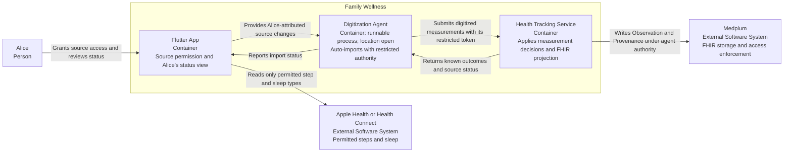
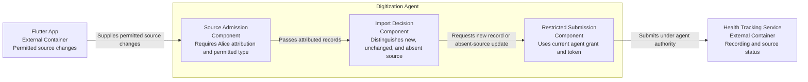
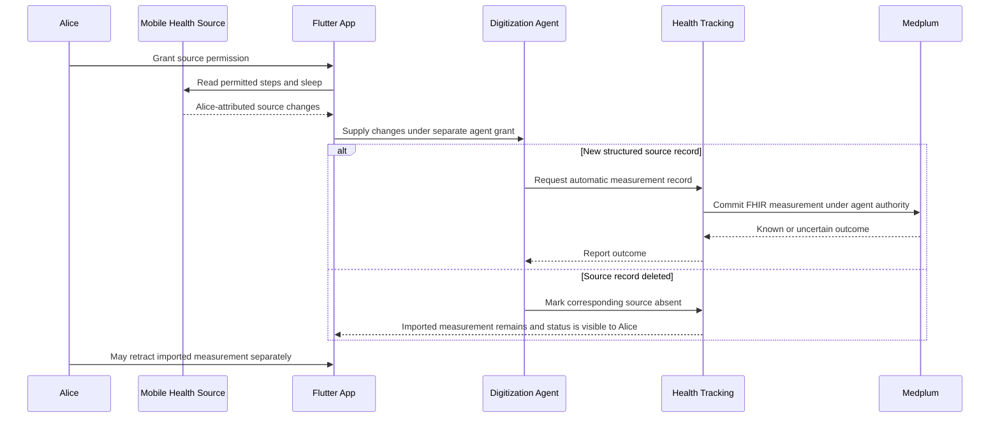

# Mobile Measurement Import — Software Design Description

**Status:** Proposed design for PR1 review; not verified.

## Purpose and scope

This SDD allocates [Alice's mobile-import user need and AC](../requirements/health_tracking.md) to the structured steps and sleep path. Both Apple Health and Android Health Connect are possible source systems. Alice grants platform read permission separately from the agent's narrow Medplum digitization grant. The agent auto-submits only Alice-attributed data. Charlie may be recorded manually or through a reviewed photo, but is not inferred from a shared mobile health source.

The MVP sleep fact is one session's start, end, and total duration. Sleep stages, other mobile types, and offline capture/sync are later slices. The OpenAPI entities own payload shapes; this SDD does not repeat them.

## Design-input allocation

| Input | Baseline AC | Responsibility |
|---|---|---|
| `DI-13` | `AC-HT-009` | Separate platform source permission and agent grant |
| `DI-4`, `DI-6` | `AC-HT-010` | Automatic step import with count and period |
| `DI-5`, `DI-7` | `AC-HT-011` | Automatic sleep import with session period and duration |
| `DI-18` | `AC-HT-012` | Explicit Alice source attribution |
| `DI-9` | `AC-HT-013` | No duplicate on unchanged source record |
| `DI-10`, `DI-19` | `AC-HT-014`–`015` | Source absence without automatic retraction |

These are baseline design inputs, not evaluated risk controls. The previous sleep-stage and offline-sync inputs are not part of this MVP allocation.

## C2 — Proposed online import containers

The diagram is an online logical container view. It does not decide whether the agent process runs on a phone or elsewhere, and it does not add a local sync store to the initial MVP.

## C3 — Digitization Agent responsibilities

These are decision responsibilities, not required files, classes, or independent services.

## Dynamic view — New and deleted mobile source records

An unchanged record creates no new logical measurement. Source deletion does not imply Alice intended to remove the imported record.

## Medplum and permission boundary

- Medplum stores committed measurements as `Observation` with source and recorder provenance; stable source identity prevents duplicate logical import. The exact source-absence FHIR representation remains a design choice.
- Platform permission allows the app to read a type; the separate agent grant and Medplum policy allow the agent to submit for Alice. Neither permission implies the other.
- A confirmed Medplum refusal after agent revocation is not retried as an authorized write. An uncertain commit is reconciled rather than reported as recorded.
- Alice's source attribution is explicit. A shared-device record is not silently assigned to Charlie.

## Open design points

- How a later source correction affects an imported value is still an EventStorming hot spot; no automatic-correction design input is allocated.
- The FHIR representation and verification of `Source Marked Absent` must be selected before implementation review.
- The agent's execution location and credential lifecycle are not decided by this SDD.

No verification evidence, control effectiveness, or residual-risk decision is claimed.
