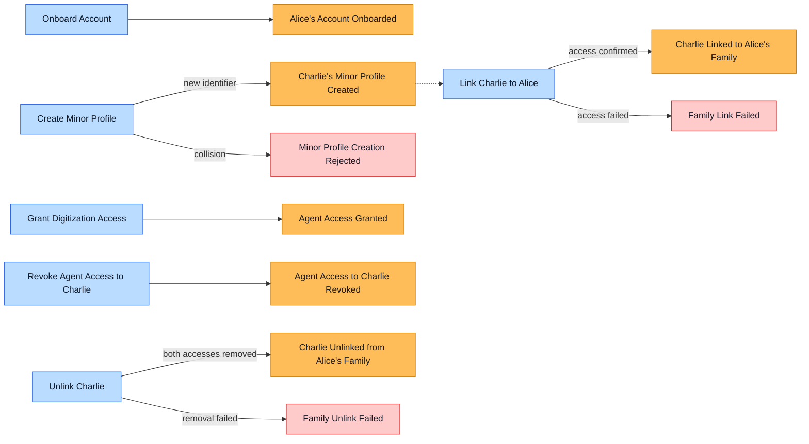
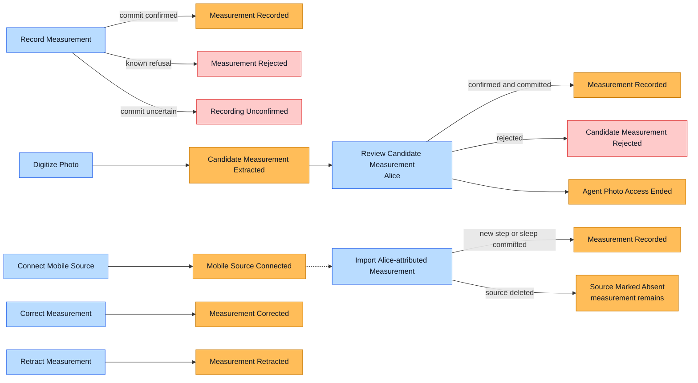

# EventStorming: Family Wellness Tracking, 2026-09-15

**Scope:** Alice onboards an account and a minor family member, then Alice or her limited agent records wellness measurements. The initial MVP includes manual entry, photo digitization, and attributed mobile steps and sleep. Offline capture and sync are a later slice. The workshop remains open at the listed hot spots.
**Participants:** Domain expert (role not stated); no separate role perspectives were voiced.

## The story

Alice signs in to her own account. Minor Charlie has a member profile but no login. Alice creates that profile on the same device and states her parent or guardian relationship; this is self-reported and trusted for the local path. Alice selects either her own or Charlie's profile before recording. A measurement belongs to exactly one selected member, and its provenance identifies who entered it. Alice can record for Charlie while their family link and Medplum access are active.

If Charlie's unique identifier already belongs to a Medplum Patient, online onboarding stops rather than creating a duplicate or automatically exposing the existing Patient. An offline-created Charlie profile and its measurements remain available locally, but their upload is blocked when the collision appears during sync. Alice may fix a typo and retry; a genuine match goes to a Medplum admin. If the admin approves linking the existing Patient and Alice's limited access becomes active, the held measurements upload automatically, without item-by-item review. Admin approval resolves identity; it is not approval of each measurement.

An agent receives its own restricted grant for selected family profiles and digitization. It can record for Alice and Charlie, but its access does not replace Alice's. If Alice removes Charlie from the agent's grant, the agent may still record for Alice; Alice may still record for Charlie. If Alice's link to Charlie ends, both Alice's and the agent's Charlie access must be removed before unlinking is complete. A delayed agent submission captured offline is rejected at save time if the grant has ended. On a confirmed permission rejection, the agent stops retrying and discards only its queued copy, not the original mobile-health record. Uncertain network outcomes retain their queued item.

The agent may digitize a photo for either Alice or Charlie. It extracts a candidate measurement; Alice checks its value, unit, and selected profile before any measurement is recorded. A rejected candidate records no measurement. The original photo remains available to Alice as restricted evidence, even when she rejects the candidate and tries again. The agent's photo access is temporary and ends when the digitization attempt ends.

Mobile source permission is separate from the agent grant. Once both are active, structured steps and sleep from Alice's attributed Apple Health or Health Connect source are saved automatically for Alice. Charlie's data is not inferred from a shared device source. For this MVP, sleep is a session with start, end, and total duration; sleep stages are later. If a source record is deleted, its imported wellness measurement remains; the source is marked absent and Alice can retract the measurement herself. Automatic handling of later source corrections remains open.

Alice's family access is limited to Charlie's profile and wellness records, not his entire clinical chart. Wellness measurements from another trusted app may appear in her family view. Who may designate a record as wellness remains open.

The agreed **online MVP** streams are stormed independently before their authority handoff is described. The later offline/identifier-recovery branch remains in the timeline and hot spots, not on this first-slice wall.

### Accounts stream

### Health Tracking stream

The three orange `Measurement Recorded` boxes name the **same event type** on different paths, not separate record domains.

**Context handoff:** Alice's account and Charlie link determine which profile she may select; the agent grant names selected profiles and digitization tasks. Mobile source permission is separate. Medplum checks current permission again when a measurement is saved, so a past grant event is not proof of present authority.

## Requirements handoff for the stable slices

The wall supplies domain facts, not ready-made acceptance criteria. Baseline AC and provisional design inputs are recorded once per slice in the linked documents; open rules remain hot spots below.

| Slice | User need and baseline AC | Design input |
|---|---|---|
| Alice onboarding and Charlie family authority | [`UN-ACC-001`–`004`](../requirements/accounts.md) | [Accounts SDD](../design/accounts.md) |
| Manual recording, photo review, and correction | [`UN-HT-001`, `002`, `004`](../requirements/health_tracking.md) | [Health Tracking SDD](../design/health_tracking.md) |
| Alice-attributed mobile steps and sleep | [`UN-HT-003`](../requirements/health_tracking.md) | [Mobile Import SDD](../design/mobile_health_sync.md) |

## Timeline

### Account and minor profile

1. **Alice's Account Onboarded:** Alice can act under her own authenticated account.
2. **Charlie's Minor Profile Created:** Alice stated her relationship to Charlie; Charlie did not receive a login or approve in-app.
   - *If an identifier already exists online:* **Minor Profile Creation Rejected**; no duplicate or automatic family link is created.
   - *If created offline and the collision appears later:* **Identifier Collision Detected** → **Charlie's Upload Blocked**. The local profile and measurements remain available to Alice.
3. **Alice's Medplum Access to Charlie Granted** → **Charlie Linked to Alice's Family:** The link is complete only after access is active.
   - *If provisioning fails:* **Family Link Failed**; it is not reported as complete.
   - *If a genuine existing-Patient match is reviewed:* **Patient Link Approved by Medplum Admin** or, tentatively, **Patient Link Rejected by Medplum Admin**. On approval, access is provisioned before the held measurements upload. The rejected-match recovery path remains open.

### Agent authority

4. **Agent Access Granted for Selected Profiles:** The agent has its own limited digitization grant; Alice is the grantor.
5. **Agent Access to Charlie Revoked:** The agent may continue to record for Alice; Alice's own access is unchanged.
6. **Charlie Unlinked from Alice's Family:** Occurs only after Medplum removes both Alice's and the agent's Charlie access.
   - *If either removal fails:* **Family Unlink Failed**; the family link stays active and completion is not reported.

### Measurements and synchronization

7. **Measurement Recorded:** One selected member is the subject. Alice or the agent is identified as recorder; agent-recorded provenance also identifies Alice as grantor.
   - *If permission is refused:* **Measurement Rejected**. A confirmed agent rejection stops retries and clears only its queued copy.
   - *If commit is uncertain:* **Recording Unconfirmed**. The queued item remains until the authoritative outcome is known.
8. **Photo Submitted** → **Candidate Measurement Extracted** → **Alice Confirmed Candidate** → **Measurement Recorded:** Alice checks value, unit, and profile before commit for herself or Charlie. The original photo is retained for Alice; the agent's temporary photo access ends with the attempt.
   - *If Alice rejects the candidate:* **Candidate Measurement Rejected**; no measurement is saved, but Alice may retry from her retained photo.
9. **Mobile Source Connected** → **Measurement Recorded:** Alice-attributed steps and sleep are saved automatically while both source permission and agent grant are active. Charlie is never inferred from a shared source.
10. **Measurement Retracted** → **Measurement Recorded for Correct Profile:** A saved measurement is never moved between members. Wrong-profile entry uses retraction and re-entry.
11. **Measurement Corrected:** A value may be corrected without changing the measurement's member. Whether a later mobile-source correction does this automatically remains open.
12. **Source Marked Absent:** A mobile-source deletion does not retract the imported measurement. Alice may retract it separately.
13. **Synchronization Completed (later offline slice):** Each available change in the attempt reached a known outcome. A refused record may be part of a completed attempt; an unconfirmed commit may not.
    - *After approved identity linkage and access:* **Held Measurements Uploaded** without separate review.
    - *After access revocation:* **Delayed Agent Submission Rejected** at Medplum save time.

Manual entry, confirmed photo digitization, and mobile import produce the same **Measurement Recorded** fact. Source and actor differences are attributes of the path, not separate measurement events. **Candidate Measurement Rejected** and **Source Marked Absent** are distinct because they change Alice's follow-up choices.

## Commands and actors

| Command | Actor | Resulting event(s) | Notes |
|---|---|---|---|
| Onboard Account | Alice | Alice's Account Onboarded | Authentication comes from Keycloak. |
| Create Minor Profile | Alice | Charlie's Minor Profile Created; Minor Profile Creation Rejected | Alice is signed in on the shared device and states her relationship. Charlie has no login. |
| Resolve Identifier Collision | Medplum admin | Patient Link Approved or Rejected | Alice can first correct an identifier typo herself. A genuine match is an admin decision. |
| Link Charlie to Alice's Family | Alice, with access provisioning | Charlie Linked to Alice's Family; Family Link Failed | Do not claim completion before Medplum access is active. |
| Grant Digitization Access | Alice | Agent Access Granted for Selected Profiles | Agent access is separate and narrower than Alice's. |
| Connect Mobile Source | Alice, with platform permission | Mobile Source Connected or connection refused | Source permission is not the agent grant. Alice-attributed steps and sleep may then auto-import. |
| Revoke Agent Access to Charlie | Alice | Agent Access to Charlie Revoked | The agent may retain Alice access. |
| Unlink Charlie | Alice, with access removal | Charlie Unlinked from Alice's Family; Family Unlink Failed | Both Alice and agent Charlie access must be removed first. |
| Select Profile, then Record Measurement | Alice or permitted agent | Measurement Recorded; Measurement Rejected; Recording Unconfirmed | Profile selection precedes recording. One member per measurement. |
| Submit Photo, Extract Candidate Measurement | Alice and permitted agent | Photo Submitted; Candidate Measurement Extracted or extraction failed | The agent's access to the photo is temporary. No measurement is committed yet. |
| Confirm or Reject Candidate Measurement | Alice | Alice Confirmed Candidate → Measurement Recorded; Candidate Measurement Rejected | Alice checks value, unit, and profile. She retains the source photo in either outcome. |
| Retract Measurement, then Record Measurement | Alice or permitted actor | Measurement Retracted; Measurement Recorded for Correct Profile | Wrong-profile correction does not transfer the original record. |
| Correct Measurement | Permitted actor | Measurement Corrected or refused/uncertain outcome | Member identity stays fixed. Automatic correction from a changed mobile source is open. The current agent grant does not automatically include general correction authority. |
| Import Mobile Health Changes | Permitted agent | Measurement Recorded, Source Marked Absent, Synchronization Completed or refusal/uncertainty | Auto-save only Alice-attributed steps and sleep. Source deletion does not retract an imported measurement. |

## External systems

- **Keycloak:** Authenticates Alice; authentication is an external fact, not an Accounts domain event.
- **Medplum:** Persists FHIR Patients and wellness Observations, enforces resource-level access at save time, and must confirm access grant/removal before family-link completion.
- **Apple Health and Android Health Connect:** Supply permitted Alice-attributed steps and sleep. Platform source permission is distinct from Alice's agent grant. A source record is distinct from the agent's queued copy.
- **Photo source:** Supplies the image used for extraction. Alice retains the original as restricted evidence; the agent receives only temporary access for digitization.

## Policies

- **Whenever** Alice records, **then** the selected profile becomes the measurement's sole subject; the authenticated recorder is retained separately.
- **Whenever** Charlie is linked to Alice's family, **then** Medplum must first activate Alice's limited Charlie access. A failed update leaves the link incomplete.
- **Whenever** Charlie is unlinked, **then** Medplum must remove both Alice's and the agent's Charlie access before reporting completion.
- **Whenever** the agent's Charlie grant is revoked, **then** the agent loses Charlie access while Alice's own capability remains unchanged.
- **Whenever** a genuine identifier collision is detected, **then** local upload is blocked until a Medplum admin resolves the Patient match.
- **Whenever** an approved Patient link and limited access become active, **then** held measurements upload automatically; each still requires Medplum permission at save time.
- **Whenever** Medplum definitively refuses an agent submission after revocation, **then** the agent stops retrying and clears its queued copy only. Unconfirmed outcomes are retained for reconciliation.
- **Whenever** a photo produces a candidate measurement, **then** Alice confirms its value, unit, and profile before a measurement is recorded. A rejected candidate saves no measurement and leaves the photo available to Alice.
- **Whenever** a photo digitization attempt ends, **then** the agent's access to the retained photo ends while Alice's restricted access continues.
- **Whenever** structured steps or sleep arrive from Alice's attributed and permitted source, **then** the agent records them automatically for Alice, subject to Medplum permission at save time.
- **Whenever** a mobile source record is deleted, **then** its imported measurement remains and the source is marked absent. Alice, not the source deletion, decides whether to retract the measurement.

## Read models

- **Alice:** Her available family profiles, the currently selected member, candidate value/unit/profile alongside the original photo, each measurement's recorder and source status, and whether offline items are blocked or synchronized.
- **Medplum admin:** The identifier-collision case and enough existing-Patient information to make an identity decision; exactly what evidence is required remains open.
- **Agent:** Its currently permitted profiles, temporary photo access for an active attempt, Alice-attributed source changes, and queued submissions. It need not browse Charlie's wellness history to submit digitized measurements.

## Aggregates

### Family Link

**Protects:** Alice's and any derivative agent access match the active relationship; an unlink cannot be complete while either retains Charlie access.
**Events:** Charlie Linked to Alice's Family; Charlie Unlinked from Alice's Family; link/unlink failures.
**Commands:** Link Charlie to Alice's Family; Unlink Charlie.
**Open question:** The response and recovery when a genuine match is rejected.

### Agent Grant

**Protects:** An agent's selected-profile digitization authority stays separate from Alice's own authority and cannot outlive her Charlie link.
**Events:** Agent Access Granted for Selected Profiles; Agent Access to Charlie Revoked.
**Commands:** Grant Digitization Access; Revoke Agent Access to Charlie.

### Measurement

**Protects:** Exactly one fixed member subject per measurement; recorder and grantor provenance remain distinguishable; retraction preserves the wrong-profile history.
**Events:** Measurement Recorded, Corrected, Retracted, Source Marked Absent; recording refusals and uncertainty.
**Commands:** Record, Correct, Retract, Import Mobile Health Changes.

### Photo Digitization Attempt

**Protects:** A photo-derived candidate is not a recorded measurement until Alice confirms value, unit, and profile; the agent's photo access does not survive the attempt.
**Events:** Photo Submitted, Candidate Measurement Extracted, Alice Confirmed Candidate or Candidate Measurement Rejected, Agent Photo Access Ended.
**Commands:** Submit Photo, Extract Candidate Measurement, Confirm or Reject Candidate Measurement.

These are consistency clusters from the workshop, not a decision that each requires a software aggregate root, class, or repository.

## Bounded contexts

### Accounts: classification not yet decided

**Language:** Account is an authenticated actor; member profile is the person whose wellness is recorded; family link and agent grant describe current authority.
**Contains:** Family Link and Agent Grant consistency clusters; account and minor-profile onboarding.
**Talks to:** Medplum to provision or remove limited access; Health Tracking relies on Medplum's execution-time authorization rather than copying the grant rule.

### Health Tracking: classification not yet decided

**Language:** Measurement is a health fact for one member, whether entered by Alice or digitized from a permitted mobile source. Recorder, grantor, and source are distinct.
**Contains:** Measurement and Photo Digitization Attempt consistency clusters and source import workflow.
**Talks to:** Medplum to persist and authorize FHIR writes; Accounts grants are prerequisites, not a past-event substitute for current permission.

The workshop retained **two** bounded contexts. Keycloak, Medplum, and the mobile health source are integrations, not extra domain contexts.

## Functional DDD handoff

The local DDD workshop uses a validate → fetch state → derive outcome → update state → publish flow. The table preserves the business decisions needed for a later pure decision function and an orchestrating command handler; it does not prescribe code or FHIR payloads. An outcome sticky is not automatically a durable published event.

| Command | Actor and request facts | State needed | Decision rule / invariant | Known outcomes | State change and follow-on policy |
|---|---|---|---|---|---|
| Create Minor Profile | Alice; Charlie's identity and self-reported relationship | Identifier match status | A collision cannot silently create or expose a second Patient | Profile Created / Creation Rejected | Accounts creates the profile only after the identity path is resolved; collision enters admin path |
| Grant Digitization Access | Alice; selected profiles and digitization task | Family link and current grant | Agent scope is narrower than Alice's and cannot outlive her Charlie link | Agent Access Granted / grant refused or failed | Accounts records selected-profile grant; Medplum provisioning must make it effective |
| Record Measurement | Alice or agent; selected member, value, unit, time, source | Active member and current measurement state | A measurement has one fixed subject; recorder is separate | Recorded / Rejected / Failed / Unconfirmed | Health Tracking records only after confirmed commit; unknown commit is reconciled before retry |
| Extract Photo Candidate | Permitted agent; photo and selected profile | Temporary photo access and extraction result | Extraction proposes a candidate, not a recorded measurement | Candidate Extracted / extraction failed | Original photo stays with Alice; no measurement changes yet |
| Confirm Photo Candidate | Alice; reviewed value, unit, profile | Candidate and original photo | Only Alice's confirmation can commit the photo-derived measurement | Confirmed then Recorded / Candidate Rejected / commit uncertain | Health Tracking records on confirmed commit; agent photo access ends in either review outcome |
| Import Mobile Health Changes | Permitted agent; attributed steps or sleep and source identity | Agent grant, platform source permission, source identity, prior import status | Only Alice-attributed structured data auto-saves for Alice; a source deletion does not retract it | Recorded / Rejected / Unconfirmed / Source Marked Absent | Health Tracking avoids duplicate import, preserves source status, and leaves retraction to Alice |
| Unlink Charlie | Alice; Charlie family link | Active link and Alice/agent Charlie access | Unlink cannot be complete while either still has Charlie access | Charlie Unlinked / Family Unlink Failed | Accounts reports completion only after Medplum confirms both access removals |

External identity checks, Medplum authorization, FHIR persistence, source permission, and uncertain transport outcomes remain integration or orchestration concerns. The business rules above can be translated into functional decisions without copying those mechanisms into the domain model.

## Hot spots

| # | Hot spot | Why it remains open | What would resolve it | Owner |
|---|---|---|---|---|
| H1 | Who may designate a Medplum record as wellness? | Alice may view wellness records from other trusted apps, but a mislabeled clinical Observation could enter her family view. Parked outside the initial MVP. | Define trusted producers and enforceable wellness designation/access boundary. | unassigned |
| H2 | What is shown for an identifier collision? | Onboarding stops without exposing an existing Patient, but the exact message and recovery UI were not agreed. | Review the privacy-safe admin referral and Alice-facing status. | unassigned |
| H3 | What if Alice's self-reported relationship to minor Charlie is disputed? | The local path trusts Alice's statement; the domain expert assessed risk as minimal, but the disputed-access outcome was not selected. | Decide dispute handling if this case enters scope. | unassigned |
| H4 | What evidence does the Medplum admin use for a genuine match, and what follows rejection? | Admin is the identity decision-maker, but the review evidence and rejected-match recovery were not stormed. | Define the minimum admin decision record and recovery outcome. | Medplum admin |
| H5 | Can the current Medplum policy represent wellness-only, multi-member, agent write-focused access? | The workshop specified scope, not its verified policy configuration. | Design and test actual Medplum AccessPolicy behavior for reads, writes, grants, and revocations. | unassigned |
| H6 | What happens when an attributed mobile source corrects a previously imported value? | Automatic source deletion does not retract the imported measurement, but a corrected step/sleep value may make the imported value wrong. | Decide whether to auto-correct with history or ask Alice to review. | Alice |
| H7 | How long is the original photo retained? | Alice keeps restricted evidence and the agent loses access after the attempt, but no retention period was agreed. | Set an explicit retention/deletion policy during privacy review. | unassigned |

## What changed during the session

1. We began with successful measurement events, then added commands and failure outcomes. Manual and mobile paths converged on the same **Measurement Recorded** event.
2. An earlier tentative board treated family access as Charlie acting for Alice. The minor scenario corrected the direction: Alice acts for Charlie. Charlie has no login or in-app approval.
3. Alice's self-member access needs no separate notification or self-link event. She selects a profile before recording; the measurement identifies both subject and recorder.
4. A duplicate identifier first looked like an automatic reuse question. We chose to stop online onboarding; later offline work remains local until admin resolution. Admin approval links identity, while automatic upload is a distinct sync policy once access is active.
5. “Fine-grained agent access” was initially misunderstood as an all-or-nothing grant. The concrete example resolved it: removing Charlie leaves the agent permitted for Alice, while Alice herself keeps working for Charlie.
6. Family-link completion moved from a past domain event alone to confirmed Medplum access changes. Revocation also invalidates queued agent submissions at save time.
7. The family view narrowed from a broad Patient compartment to profile plus wellness records. It then expanded across trusted wellness-producing apps; designation trust remains open.
8. Agent digitization split into photo extraction and mobile import. Photo candidates require Alice's confirmation for either profile; structured Alice-attributed steps and sleep auto-save after separate platform source permission and agent grant.
9. We first treated mobile-source deletion as automatic retraction. Alice challenged that: the imported measurement now remains, its source is marked absent, and Alice alone may retract it. Later source corrections remain open.
10. We added a functional DDD decision chain so command facts, needed state, invariants, outcomes, and follow-on policies can be translated without making the EventStorming wall a code specification.

## Next steps

1. Draft user needs, baseline acceptance criteria, and provisional design inputs for the stable onboarding, manual measurement, photo digitization, and Alice-attributed mobile-import slices; keep H6 open.
2. Prototype and test limited Alice and agent policies, including existing-Patient reads, Observation writes, temporary photo access, and revocation.
3. Define the Medplum admin collision review and Alice-facing blocked-sync status for the later offline slice without automatic Patient disclosure.
