# Medplum OTS periodic review

OTS item: [Medplum OTS record](medplum_ots.md)

## Review baseline

| Item | Finding |
|---|---|
| Source reviewed | Commit `771a512d24b31948fcfc78dacdd6fbe36b72e416`; version `5.1.37` |
| Pulled `latest` server | `medplum/medplum-server@sha256:84e1f8869ea390b125aaa451461dce1d7174844487c8fab35ef4c86e76a64a4d`; Linux ARM64; contains `@medplum/server 5.1.39` |
| Pulled `latest` app | `medplum/medplum-app@sha256:9879a4a506b98e8ddf86fe447fa054a577665b56f77bbedbfcdad2c37bd28104`; Linux ARM64 |
| Deployed version | Not evidenced. The pulled images are review candidates, not proof of the running deployment. Compose still uses mutable `latest` tags. |
| Delivery model | Cloud versus self-hosted not decided |
| Support status | Version policy reviewed; applicable agreement and EOL date not evidenced |
| Scan tools | Syft `1.51.1`; Grype `0.118.0`; vulnerability DB `v6.1.9`, built `2026-09-15T06:31:36Z` |

## SBOM and vulnerability scan

| Image | SBOM packages | Grype result |
|---|---:|---|
| Server | 629 | 83 package matches covering 32 unique vulnerability IDs: 3 Critical, 11 High, 8 Medium, 1 Low, 7 Negligible, and 2 Unknown. Forty-four matches list a fix. |
| App | 71 | 8 package matches covering 6 unique vulnerability IDs: 2 High and 4 Medium. No match lists a fix. |

Server Critical matches concern `libc6`, `libssl3t64`, and `openssl-provider-legacy`. App High matches concern `tiff`. Scanner severity does not establish exploitability, patient risk, or applicability to the Medplum execution path.

Evidence:

- [Server SPDX SBOM](../../evidence/ots/medplum/server.sbom.spdx.json)
- [Server Grype report](../../evidence/ots/medplum/server.grype.json)
- [App SPDX SBOM](../../evidence/ots/medplum/app.sbom.spdx.json)
- [App Grype report](../../evidence/ots/medplum/app.grype.json)

## Vulnerability review

| ID | Finding | Applicability |
|---|---|---|
| `OTS-V-01` | [CVE-2026-44506](https://github.com/medplum/medplum/security/advisories/GHSA-ch8p-j6cm-r7w5): OAuth client-secret disclosure; affected server `>=4.1.10, <5.1.7`; fixed in `5.1.7` | Reviewed source is outside the range. Deployment remains open pending the actual version and dynamic-registration configuration. |
| `OTS-V-02` | [CVE-2026-53728](https://github.com/medplum/medplum/security/advisories/GHSA-m44r-7c5h-m6mj): authorization-code leakage through external-auth redirect; affected core `<=5.1.5`; fixed in `5.1.6` | Reviewed source is outside the range. Deployment remains open pending the actual version and redirect configuration. |

This is not a complete vulnerability scan.

## CVE risk analysis

Snyk-style triage is used without inventing its proprietary score:

- Impact: confidentiality, integrity, availability, and affected user need.
- Likelihood: exploit evidence, EPSS, dependency depth, and reachability.
- Actionability: whether a fix exists.

This review assessed impact and reachability. Exploit evidence and EPSS remain open. `NO PATH FOUND` does not mean impossible to exploit.

| Risk | CVEs | Trigger needed | User-need impact | Linked risk | Status |
|---|---|---|---|---|---|
| `OTS-CVE-01` OpenSSL | `2026-14456`, `14457`, `18798`, `54874`, `63072`, `63073`, `63075`, `63076`, `75803` | Use of the affected QUIC, DTLS, CMP, CMS, RPK, or AEAD path with attacker-controlled input | Authentication or recording becomes unavailable, or forged data is accepted: `UN-ACC-001`, `UN-HT-001`–`004` | `OTS-M-02`; `OTS-S-01/02`; tampering and denial of service | `NO PATH FOUND`: matched system OpenSSL is not loaded by Node; specialized APIs were not found; forged empty-tag test was rejected. |
| `OTS-CVE-02` glibc | `2026-19499`, `5435`, `5450`, `5928` | A vulnerable libc function receives attacker-controlled input | Recording, import, or correction becomes unavailable, or family data is disclosed: `UN-HT-001`, `003`, `004` | `OTS-M-02`; `OTS-S-02/03`; disclosure and denial of service | `INCONCLUSIVE`: glibc is loaded; no direct source call was found, but native/transitive paths were not fully analyzed. |
| `OTS-CVE-03` zlib | `2026-85091` | Vulnerable non-blocking gzip write sequence is executed | Recording, import, or correction becomes unavailable: `UN-HT-001`, `003`, `004` | `OTS-M-02`; `OTS-S-02`; denial of service | `NO PATH FOUND`: matched system zlib is not loaded by Node; Node uses embedded zlib and no vulnerable `gz*` call was found. |
| `OTS-CVE-04` TIFF | `2023-52356`, `2026-4775` | The app container decodes an attacker-controlled TIFF | Would affect photo digitization under `UN-HT-002` | `OTS-M-02`; denial of service or elevation of privilege | `NO PATH FOUND`: NGINX does not link libtiff and the installed image-filter module is not loaded. |

CVSS/Grype severity is supplier input, not the project's safety-risk estimate. No probability, severity, acceptability, or control decision is made.

### Reachability evidence

```mermaid
flowchart TD
    Finding["Component vulnerability reported by Grype"] --> Present{"Component present in reviewed image?"}
    Present -->|No| NotApplicable["NOT APPLICABLE"]
    Present -->|Yes| Runtime{"Component loaded or enabled at runtime?"}

    Runtime -->|No| NoPath["NO PATH FOUND"]
    Runtime -->|Yes| Trigger{"Affected function or feature used?"}
    Trigger -->|No evidence found| NoPath
    Trigger -->|Yes| Input{"Attacker-controlled input can reach it?"}
    Trigger -->|Not fully analyzed| Inconclusive["INCONCLUSIVE"]
    Input -->|Yes| Reachable["REACHABLE"]
    Input -->|No evidence found| NoPath
    Input -->|Not fully analyzed| Inconclusive

    OpenSSL["OpenSSL CVEs"] --> OpenSSLResult["NO PATH FOUND<br/>matched system library not loaded;<br/>affected features not found"]
    Zlib["zlib CVE"] --> ZlibResult["NO PATH FOUND<br/>matched system library not loaded;<br/>affected gz* path not found"]
    TIFF["TIFF CVEs"] --> TIFFResult["NO PATH FOUND<br/>image-filter module not loaded"]
    Glibc["glibc CVEs"] --> GlibcResult["INCONCLUSIVE<br/>library loaded;<br/>native and transitive paths remain open"]

    NoPath -. "current reviewed-image findings" .-> OpenSSLResult
    NoPath -. "current reviewed-image findings" .-> ZlibResult
    NoPath -. "current reviewed-image findings" .-> TIFFResult
    Inconclusive -. "current reviewed-image finding" .-> GlibcResult

    classDef decision fill:#dbeafe,stroke:#2563eb,color:#111827
    classDef clear fill:#dcfce7,stroke:#16a34a,color:#111827
    classDef open fill:#fef3c7,stroke:#d97706,color:#111827
    classDef reachable fill:#fecaca,stroke:#dc2626,color:#111827
    class Present,Runtime,Trigger,Input decision
    class NotApplicable,NoPath,OpenSSLResult,ZlibResult,TIFFResult clear
    class Inconclusive,GlibcResult open
    class Reachable reachable
```

`NO PATH FOUND` records the evidence available for this reviewed image and configuration; it is not proof that exploitation is impossible.

- Server runtime: Node `24.18.1`, embedded OpenSSL `3.5.7`, and embedded zlib `1.3.1-e00f703`.
- Node does not load the Grype-matched system OpenSSL or zlib libraries. QUIC is absent, specialized vulnerable APIs were not found, and a forged empty ChaCha20-Poly1305 tag was rejected.
- Glibc is loaded. No direct vulnerable-function call was found, but native and transitive paths were not fully analyzed.
- App runtime: NGINX `1.31.6` serves static files. Its configuration does not load the installed image-filter module, and NGINX does not link libtiff.
- These findings apply only to the reviewed image digests and configuration. Reassess after a relevant change.

## Maintenance and licensing review

- The pulled server contains Medplum `5.1.39`, while the reviewed repository source is `5.1.37`; their correspondence has not been established.
- No immutable deployed baseline, named maintenance owner, support agreement, current defect list, or upgrade evidence was provided.
- The reviewed source still declares Apache-2.0 and includes a NOTICE.
- SPDX license data is incomplete: all 71 app packages and 618 of 629 server packages report `NOASSERTION`. No exact-artifact license clearance or license-change report was provided.
- No license noncompliance is asserted.

## Review outcome

The candidate images now have SBOM and Grype evidence. Applicability and risk evaluation remain blocked until the deployed baseline, configuration, Critical/High finding dispositions, support terms, complete license evidence, and approved risk criteria are available. No control, residual-risk decision, or risk-based acceptance criterion is added.

The Class A maintenance, feedback, change-impact, and trend-analysis checklist items remain open. They are deliberately not annotated with RDM coverage markers: `62304:6.1.f`, `62304:6.2.1.1`–`62304:6.2.1.3`, `62304:7.4.1.a`–`62304:7.4.1.b`, and `62304:9.6`.
