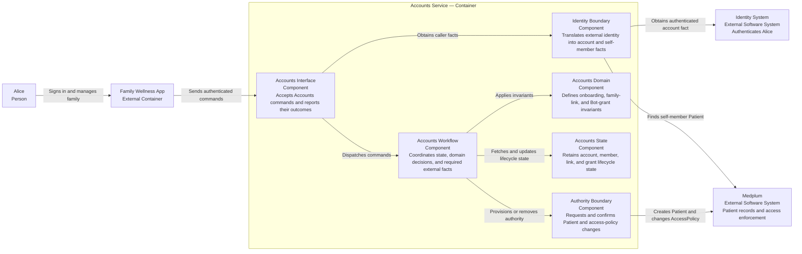

# Accounts — Software Design Description

**Status:** Proposed design for PR1 review; not verified.

## Purpose and scope

This SDD allocates the [Accounts user needs and AC](../requirements/accounts.md) to account onboarding, minor profiles, family links, and a separate Digitization Bot grant. The digitization agent is the Medplum Bot service actor, not a human delegate. An identity system supplies Alice's authentication as an external fact. Medplum stores the Patient/profile and enforces the resulting access policy; Accounts owns the meaning and lifecycle of family and Bot authority.

The OpenAPI contract owns request and response shapes. This SDD does not repeat them. Identifier-collision recovery after referral to a Medplum admin remains open. The minor relationship is self-reported for the local MVP path; no independent guardian verification is claimed.

## Design-input allocation

| Input        | Baseline AC         | Responsibility                                   |
| ------------ | ------------------- | ------------------------------------------------ |
| `DI-ACC-001` | `AC-ACC-001`–`002`  | Onboarding and self-member association           |
| `DI-ACC-002` | `AC-ACC-003`        | Minor profile creation                           |
| `DI-ACC-003` | `AC-ACC-004`, `006` | Family-link completion after access provisioning |
| `DI-ACC-004` | `AC-ACC-005`        | Identifier-collision refusal                     |
| `DI-ACC-005` | `AC-ACC-007`–`008`  | Separate selected-profile Digitization Bot grant |
| `DI-ACC-006` | `AC-ACC-009`–`010`  | Profile-specific Bot revocation                  |
| `DI-ACC-007` | `AC-ACC-011`–`012`  | Family unlink after access removal               |

These are baseline design inputs, not risk-control allocations.

## C3 — Proposed Accounts service responsibilities

The Accounts Interface owns transport validation and response mapping. The Accounts Workflow fetches lifecycle
state, applies the Accounts Domain invariants, invokes the required boundaries, and records the resulting state.
Identity systems and Medplum are external boundaries; their mechanisms do not determine the domain decisions.

## Decision and integration rules

- Accounts distinguishes Alice's authenticated account from a member profile and from the Digitization Bot's grant. Charlie is a minor member, not a login principal.
- A family link is not complete on an access-provisioning request alone; Medplum must confirm the resulting limited access.
- The Bot has no default authority over Alice's profiles. Its scope exists only while Alice's grant is active and is limited to selected-profile digitization, not a copy of Alice's broader policy or authority to impersonate her. Removing Charlie from the Bot grant does not remove Alice's own Charlie access or the Bot's separately granted Alice access.
- Ending the Charlie link requires both Alice and derivative Bot Charlie access to be removed before completion is reported. A failed removal leaves the link active.
- A Medplum permission refusal when the Bot attempts an operation is authoritative for current access. A past `Agent Access Granted` event cannot substitute for that check.
- Medplum resources are the durable source of truth for account, member, family-link, and agent-grant state.
- For baseline acceptance evidence, a self-link is an Accounts-created `RelatedPerson`, and an in-app approval request is a `Task` targeting the member Patient. Onboarding creates neither artifact for Alice, and minor-profile creation creates no approval `Task` for Charlie.
- The Accounts acceptance fixture executes a Medplum Bot under its own `ProjectMembership` and scoped `AccessPolicy`;
  `AC-ACC-007`–`010` observe grant and revocation behavior through that Bot identity.

## Open design points

- The exact wellness-only classification and Medplum policy must be demonstrated before claiming Charlie's clinical chart is inaccessible.
- The authorized Medplum actor and provisioning path for applying Alice's family and Bot grant changes are open. This SDD does not assume Alice or the Digitization Bot can directly edit access policy, or introduce a broad service account.
- The privacy-safe collision message and Medplum admin recovery path are not yet agreed.

No control effectiveness, residual-risk acceptability, or completed verification is claimed.
