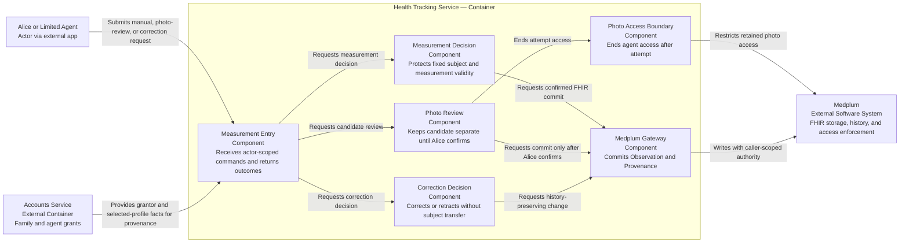
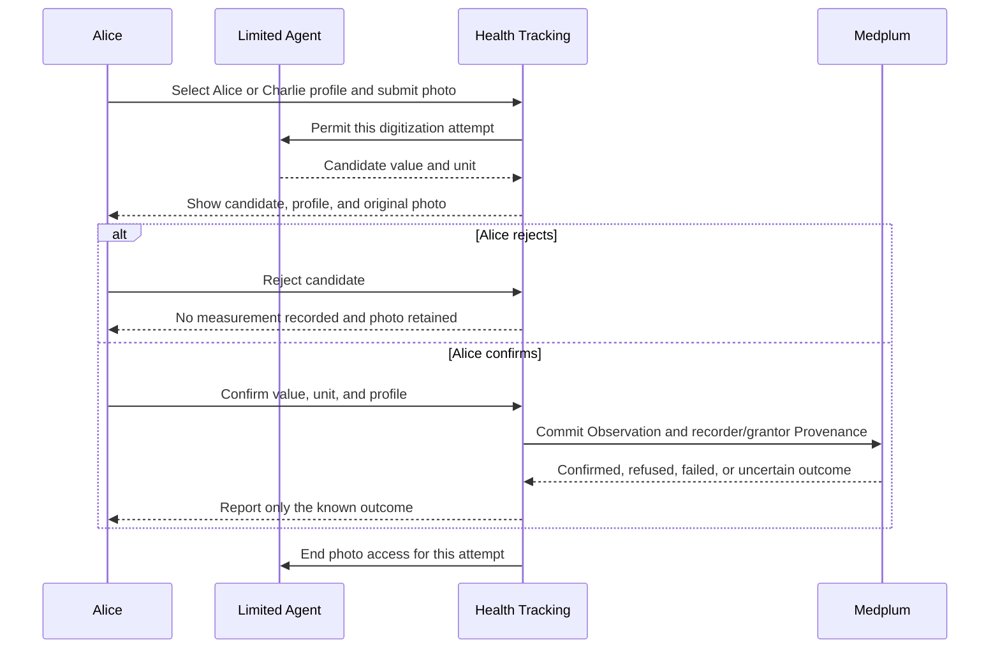

# Health Tracking — Software Design Description

**Status:** Proposed design for PR1 review; not verified.

## Purpose and scope

This SDD allocates [manual recording, photo digitization, and correction needs](../requirements/health_tracking.md) to one Health Tracking context. A measurement has one member subject; Alice or her restricted agent is a separate recorder. Photo extraction proposes a candidate, not a saved measurement. Mobile steps and sleep are covered in the [Mobile Import SDD](./mobile_health_sync.md).

Medplum is the external FHIR repository and execution-time authorization point. The OpenAPI entities own payload shapes; this SDD does not repeat them. It describes required behavior and responsibility boundaries, not file layout or command-handler coding conventions.

## Design-input allocation

| Input | Baseline AC | Responsibility |
|---|---|---|
| `DI-14` | `AC-HT-001` | Fixed member subject and separate recorder |
| `DI-1`, `DI-2` | `AC-HT-002`–`003` | Height and weight FHIR projection |
| `DI-3` | `AC-HT-004`, `018` | Confirmed versus refused, failed, or uncertain outcome |
| `DI-15` | `AC-HT-005`–`006` | Candidate review before photo-derived commit |
| `DI-16`, `DI-17` | `AC-HT-007`–`008` | Restricted source-photo retention and attempt access |
| `DI-20`, `DI-21` | `AC-HT-016`–`017` | Historical correction and wrong-profile retraction |

These are baseline design inputs, not evaluated risk controls.

## C3 — Proposed Health Tracking service responsibilities

The arrows from Accounts carry grant facts, not a cached authorization decision. Medplum checks access again at save time. Components are logical responsibilities; the diagram does not decide deployment or require classes.

## Dynamic view — Photo-derived measurement

The original photo remains restricted evidence for Alice in either review outcome. A known refusal, technical failure, or unconfirmed commit is not reported as `Measurement Recorded`.

## Medplum and authorization boundary

- Health Tracking maps a committed measurement to a FHIR `Observation` and recorder/grantor provenance to `Provenance`. Medplum preserves resource history for corrections.
- Measurement writes use the current Alice- or agent-scoped authority. There is no broad service account in the measurement write path; Medplum permission is checked on each attempted save.
- Agent grant facts do not confer FHIR permission by themselves. A confirmed `403` after grant revocation refuses the save; an uncertain commit remains unconfirmed until reconciled.
- [Medplum's Binary policy matcher](../../../../../packages/core/src/access.ts) does not apply per-photo criteria. Exact-photo temporary access may require an application-mediated boundary; its mechanism and direct Binary/presigned-URL tests remain open. `DI-17` states the desired result, not a verified mechanism.

## Open design points

- The retained-photo deletion period is not yet selected.
- The photo access boundary must be chosen and tested before claiming that the agent cannot read a retained photo after attempt closure.
- The profile-selection API contract and existing measurement implementation must be reconciled; OpenAPI owns the final shape.

No verification evidence, control effectiveness, or residual-risk decision is claimed.
