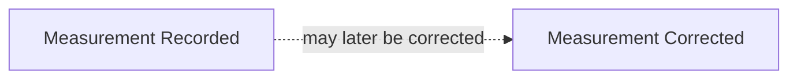
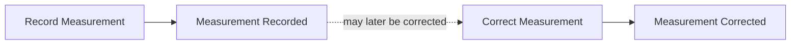
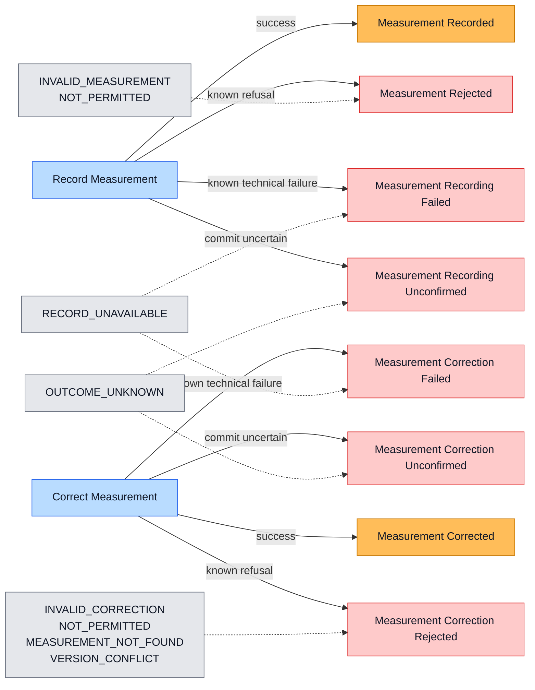
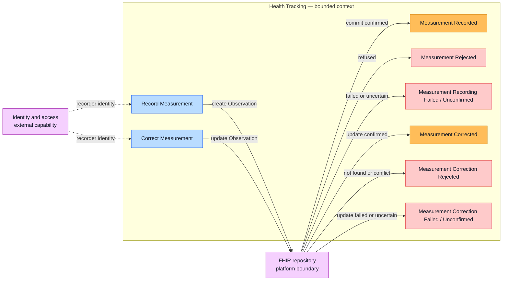

# Health Tracking Event Storming

Start here for the evolving workflow. See [CONTEXT.md](./CONTEXT.md) for the agreed domain language.

## Scope

Record or correct one height or weight measurement for the active member.

## Workshop phases

1. Successful domain events
2. Commands that cause those events
3. Failure events

Only the active phase is placed on the storming board. Later-phase details stay in the parking lot.

## Phase 1 — Successful events (agreed)

- **Measurement Recorded:** A height or weight measurement was committed to the authoritative health record.
- **Measurement Corrected:** A recorded measurement was corrected and its previous value remains available in history.

## Phase 2 — Commands (agreed)

- **Record Measurement:** Request that a height or weight measurement be committed for the active member.
- **Correct Measurement:** Request a correction to an existing recorded measurement without losing its history.

## Phase 3 — Failure outcomes

Notation: blue is a command, orange is a successful domain event, red is a failed-command outcome, and grey lists stable
reason codes. A failed-command outcome becomes a durable domain event only when another business process needs to react to
it.

- **Rejected:** A known rule prevented the commit. The requester must change the request, actor, or target before retrying.
- **Failed:** A known technical problem prevented the commit. A safe retry may succeed.
- **Unconfirmed:** The response was lost or interrupted after submission, so commit success is unknown. Verify the
  authoritative record before retrying.

## Context boundary

The current storm demonstrates one bounded context: **Health Tracking**. Identity and access provides an external
capability, while the FHIR repository is a platform boundary used for persistence.

| Participant | Classification | Responsibility |
| --- | --- | --- |
| Health Tracking | Bounded context | Measurement commands, rules, events, and caller-facing outcomes |
| Identity and access | External capability | Recorder identity and access decisions |
| FHIR repository | Platform boundary | Persistence, FHIR validation, version history, and storage outcomes |

Health Tracking translates external decisions and storage outcomes into its own language. FHIR and HTTP terms do not
cross into the core domain model.

## Agreed decisions

- A recorder may be the member, a permitted family caregiver, or a practitioner.
- The active member comes from the recording context; measurement details do not select the member.
- `Measurement Recorded` occurs only after the measurement is committed to the authoritative health record.
- Corrections preserve history using FHIR resource versioning; the domain does not maintain a parallel history model.

## Parking lot

- The request and domain payload currently contain `patientId`, which conflicts with the active-member decision.
- Correction provenance—who corrected the measurement and why—has not yet been decided.
- Whether recording or correcting height or weight triggers BMI calculation has not been decided.
- The correction command and its failure outcomes are not yet implemented.
- Authentication failure occurs before either command and therefore stays outside this domain flow.
- BMI calculation remains outside this context grouping until its triggering rule is agreed.

## Next question

Does any failure outcome need durable auditing or trigger another workflow? If not, it remains a command result rather
than a domain event.
