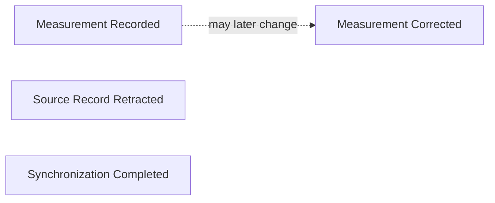
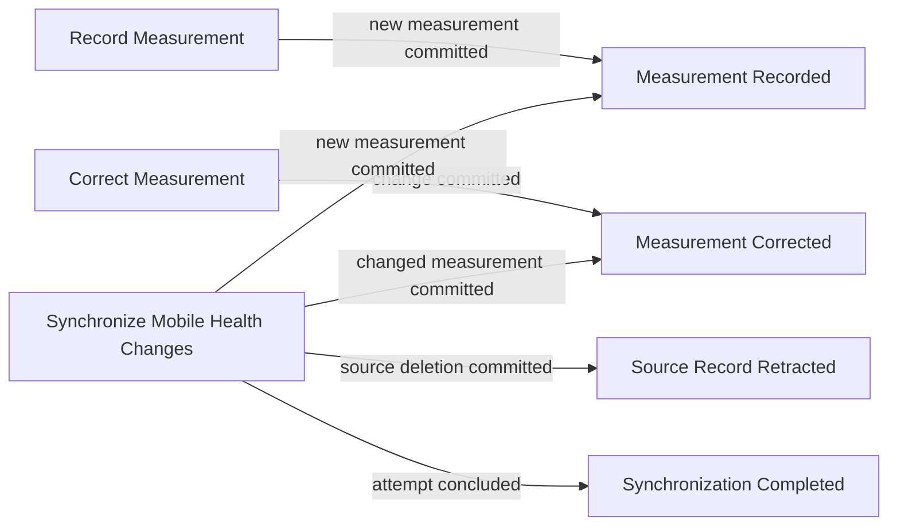
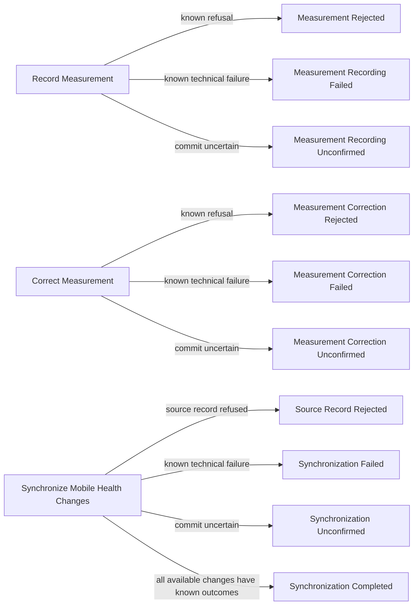
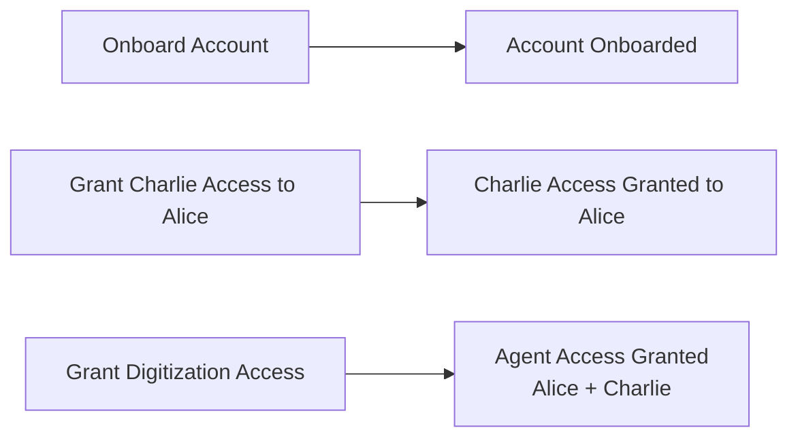
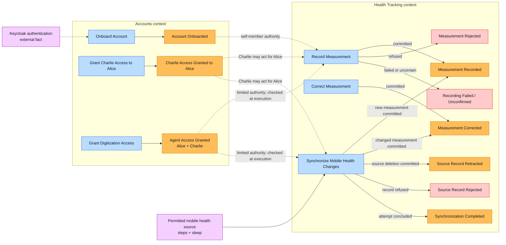

# Accounts and Health Tracking Event Storming

This workshop records how the model evolved, not just its final diagram. The agreed Health Tracking language is in
[CONTEXT.md](./CONTEXT.md); Accounts language is still being explored.

## How we got here

1. We started with successful events for a person recording height or weight and for synchronizing mobile step counts
   or sleep sessions. We stormed those streams independently before connecting them.
2. We added the commands that could produce each event: record, correct, and synchronize.
3. We added known refusals, technical failures, and uncertain outcomes. These are failed-command outcomes; whether
   each needs a durable domain event is not yet decided.
4. We expanded the board to account onboarding, family access, and limited agent digitization access because those
   outcomes affect who may act for a member.
5. We recognized that a mobile step count or sleep session **is a measurement**. Source identity and synchronization
   do not make it a separate health fact. Manual and mobile paths therefore share `Measurement Recorded` and
   `Measurement Corrected`.
   We then separated **who acts** (a person or limited agent) from **how a measurement arrives** (direct submission or
   source reconciliation).
6. We grouped the events by ownership: **Accounts** owns onboarding and grants; **Health Tracking** owns measurements.
   Keycloak authentication and the mobile health source remain external facts. Grant events show a prerequisite, not
   automatic authorization at command execution.

## Phase 1 — Successful events

We first identified these facts without assuming commands or failures:

- **Measurement Recorded:** One measurement was committed for the intended member. Height, weight, steps, and sleep
  use the same event name.
- **Measurement Corrected:** A previously recorded measurement changed; its earlier value remains in history.
- **Source Record Retracted:** A mobile source reported a deletion, and that measurement is no longer current without
  erasing its history.
- **Synchronization Completed:** Every available change in the attempt reached a known outcome. Some records may have
  been refused or failed.

The first two events describe the measurement regardless of source. The last two describe source reconciliation.
There is no second `Mobile Health Record Synchronized` measurement event.

## Phase 2 — Commands

Only after naming the successful facts did we ask what requests produce them:

`Record Measurement` currently covers directly submitted height or weight; `Synchronize Mobile Health Changes`
currently covers permitted step-count and sleep source changes. A permitted person or agent may use either command
within their own authority. The current digitization grant does not authorize `Correct Measurement`. Different
commands converge on the same measurement events.

## Phase 3 — Failure outcomes

We then considered what happens when a command does not confirm a successful commit:

| Outcome | Meaning | Examples of reason codes |
| --- | --- | --- |
| Rejected | A known rule prevented the commit; the request, actor, or target must change. | `INVALID_MEASUREMENT`, `INVALID_CORRECTION`, `INVALID_SOURCE_RECORD`, `NOT_PERMITTED`, `MEASUREMENT_NOT_FOUND`, `VERSION_CONFLICT` |
| Failed | A known technical problem prevented the commit; a safe retry may succeed. | `SOURCE_UNAVAILABLE`, `RECORD_UNAVAILABLE` |
| Unconfirmed | Submission happened, but the authoritative commit outcome is unknown; verify before retrying. | `OUTCOME_UNKNOWN` |

`Synchronization Completed` may include refused or failed individual records, but not a record whose outcome remains
unknown. Authentication failure occurs before these domain commands. Failed-command outcomes become durable domain
events only if another business process needs to react to them.

## Phase 4 — Related Accounts events

The measurement commands raised a prior question: whose member record may the person or agent act on? We expanded the
happy-path board without changing the measurement event names:

`Account Onboarded` establishes self-member authority. Charlie's grant is authority to act **for Alice**, not to
select Charlie as the active member. The agent grant is narrower than a person's authority: it covers digitization
commands for Alice and Charlie only, and its current scope is checked when either command executes. Accounts failure
outcomes and grant revocation have not yet been
stormed, so they are not invented on this board.

## Phase 5 — Bounded contexts and connections

We kept the final view simple: two bounded contexts, shared measurement events, and external inputs. Dashed links
represent authority prerequisites, **not** automatic authorization or an assumed event bus.

| Boundary | Owns | Does not own |
| --- | --- | --- |
| Accounts | Account onboarding, family grants, and limited agent grants | Measurements or mobile source reconciliation |
| Health Tracking | Recording, correction, retraction, and synchronization outcomes | Authentication or grant lifecycle |
| Keycloak | Authentication fact | Accounts or Health Tracking domain events |
| Mobile health source | Step and sleep source changes | The authoritative member record |
| Medplum | FHIR persistence and resource-level access enforcement | Either bounded context's domain language |

At execution, Health Tracking needs the current actor-to-member authority, and Medplum must permit the specific FHIR
write. A past grant event alone is not sufficient. This board does not choose whether the contexts communicate by a
direct query, a projection, or another mechanism; that contract belongs in design.

## Agreed decisions

- A person may record or synchronize for themselves or, when permitted, another member. A limited agent may record or
  synchronize only for members within its digitization grant; the grant does not copy the person's broader authority.
- Measurement details do not select or change the active member.
- `Measurement Recorded` and `Measurement Corrected` are source-neutral and occur only after an authoritative commit.
- Corrections and retractions keep prior values available in history; the domain does not maintain a parallel history
  model.
- Mobile synchronization starts with step counts and sleep sessions, which are measurements.
- Synchronization completion can include records that were not synchronized if their outcomes are known.
- Accounts grant events express authority prerequisites; current access is checked at execution.
- Mobile synchronization is a workflow within Health Tracking, not a third bounded context.

## Parking lot

- The current request and domain payload contain `patientId`, which conflicts with the active-member decision.
- Correction provenance—who corrected the measurement and why—has not yet been decided.
- Whether recording or correcting height or weight triggers BMI calculation has not been decided.
- The correction command and its failure outcomes are not yet implemented.
- The standard FHIR representation of sleep stages has not been selected.
- Accounts failure outcomes, grant revocation, and the current-authority contract need their own storming pass.
- Grant provisioning into Medplum access policy has not yet been designed.
- Whether failure outcomes or synchronization status require durable domain events beyond the authoritative FHIR
  record has not been decided.
