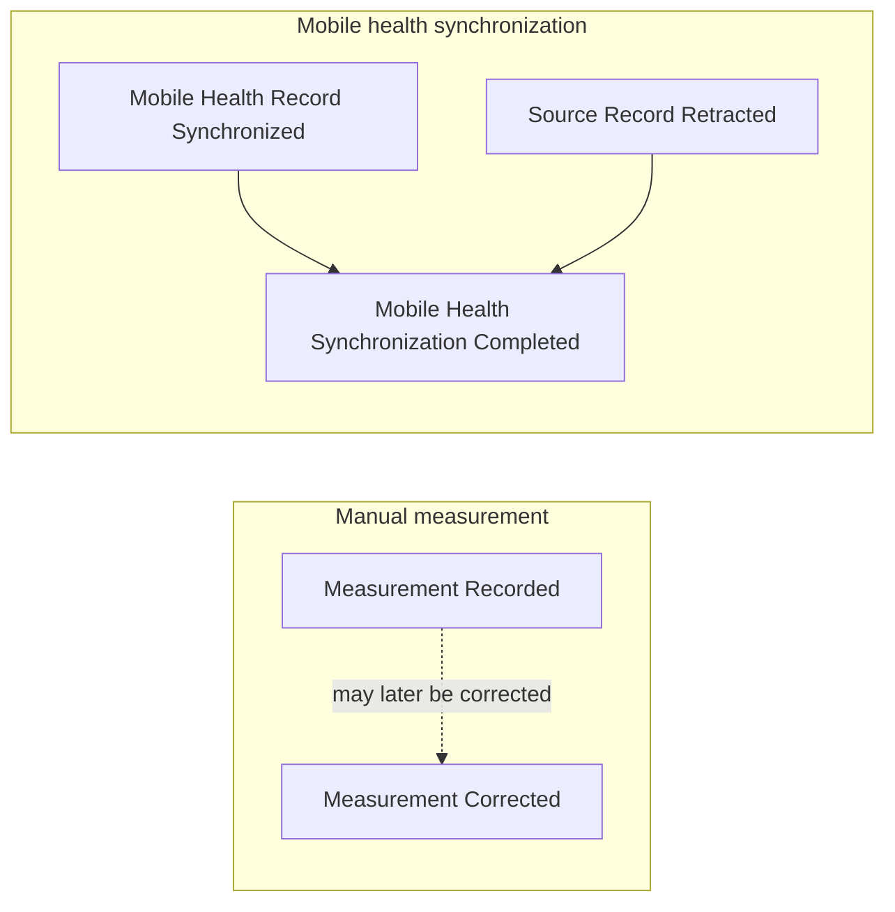
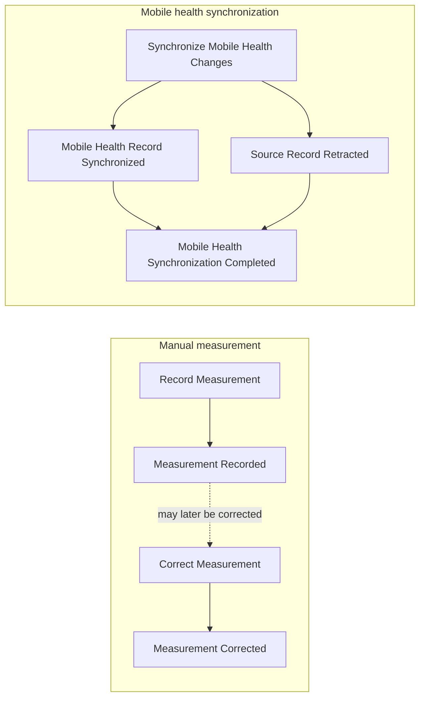
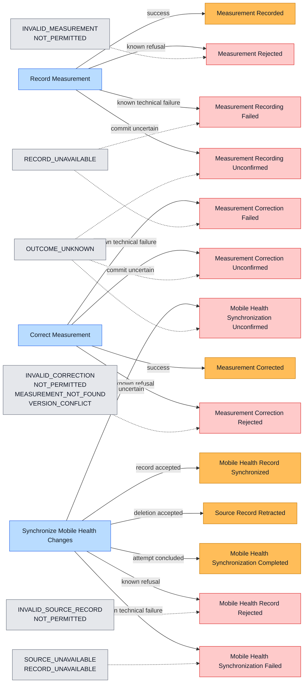
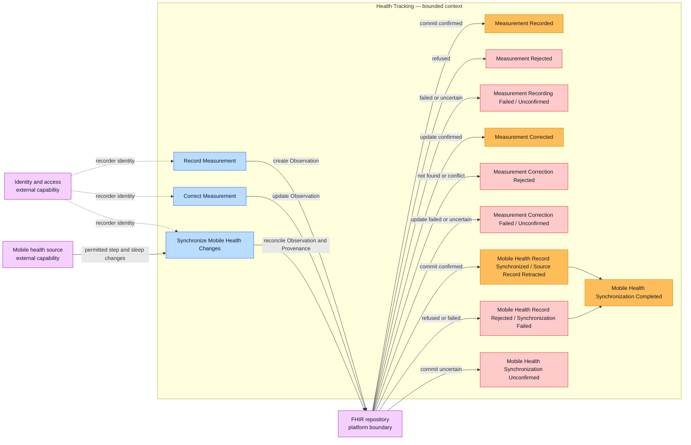

# Health Tracking Event Storming

Start here for the evolving workflow. See [CONTEXT.md](./CONTEXT.md) for the agreed domain language.

## Scope

Storm two event streams independently before connecting them:

1. Record or correct one height or weight measurement for the active member.
2. Synchronize permitted step-count records and sleep sessions for the active member.

## Workshop phases

1. Successful domain events
2. Commands that cause those events
3. Failure events

Only the active phase is placed on the storming board. Later-phase details stay in the parking lot.

## Phase 1 — Successful events (agreed)

- **Measurement Recorded:** A height or weight measurement was committed to the authoritative health record.
- **Measurement Corrected:** A recorded measurement was corrected and its previous value remains available in history.
- **Mobile Health Record Synchronized:** The current state of a step-count record or sleep session was committed to the
  active member's authoritative health record.
- **Source Record Retracted:** A source-reported deletion was reflected so the synchronized record is no longer current
  and its history remains available.
- **Mobile Health Synchronization Completed:** Every available source change in the synchronization attempt has a known
  outcome. Completion can include records that were not synchronized.

## Phase 2 — Commands (agreed)

- **Record Measurement:** Request that a height or weight measurement be committed for the active member.
- **Correct Measurement:** Request a correction to an existing recorded measurement without losing its history.
- **Synchronize Mobile Health Changes:** Request reconciliation of permitted step-count or sleep source changes with
  the active member's authoritative health record.

## Phase 3 — Failure outcomes

Notation: blue is a command, orange is a successful domain event, red is a failed-command outcome, and grey lists stable
reason codes. A failed-command outcome becomes a durable domain event only when another business process needs to react to
it.

- **Rejected:** A known rule prevented the commit. The requester must change the request, actor, or target before retrying.
- **Failed:** A known technical problem prevented the commit. A safe retry may succeed.
- **Unconfirmed:** The response was lost or interrupted after submission, so commit success is unknown. Verify the
  authoritative record before retrying.
- **Completed with exceptions:** The attempt reached a known outcome for every available change, but one or more records
  were rejected or failed. Completion does not mean that every record was synchronized.

## Context boundary

The current storm demonstrates one bounded context: **Health Tracking**. Identity and access provides an external
capability, while the FHIR repository is a platform boundary used for persistence.

| Participant          | Classification      | Responsibility                                                                      |
| -------------------- | ------------------- | ----------------------------------------------------------------------------------- |
| Health Tracking      | Bounded context     | Measurement and synchronization commands, rules, events, and caller-facing outcomes |
| Identity and access  | External capability | Recorder identity and access decisions                                              |
| Mobile health source | External capability | Permitted step-count and sleep source records and changes                           |
| FHIR repository      | Platform boundary   | Persistence, FHIR validation, version history, and storage outcomes                 |

Health Tracking translates external decisions and storage outcomes into its own language. FHIR and HTTP terms do not
cross into the core domain model.

## Agreed decisions

- A recorder may be the member, a permitted family caregiver, or a practitioner.
- The active member comes from the recording context; measurement details do not select the member.
- `Measurement Recorded` occurs only after the measurement is committed to the authoritative health record.
- Corrections preserve history using FHIR resource versioning; the domain does not maintain a parallel history model.
- Mobile health synchronization starts with step-count records and sleep sessions.
- A source record is synchronized only after its current state is committed to the authoritative health record.
- Synchronization completion can include records that were not synchronized, provided their outcomes are known.
- Source-reported deletion makes a synchronized record no longer current without erasing its history.

## Parking lot

- The request and domain payload currently contain `patientId`, which conflicts with the active-member decision.
- Correction provenance—who corrected the measurement and why—has not yet been decided.
- Whether recording or correcting height or weight triggers BMI calculation has not been decided.
- The correction command and its failure outcomes are not yet implemented.
- Authentication failure occurs before either command and therefore stays outside this domain flow.
- BMI calculation remains outside this context grouping until its triggering rule is agreed.
- The standard FHIR representation of sleep stages has not been selected.
- Whether mobile synchronization outcomes require durable domain events beyond the authoritative FHIR record has not
  been decided.

## Next question

Does a rejected, failed, or unconfirmed mobile health record need a durable domain event to trigger recovery? If not,
it remains a command result and synchronization status.
